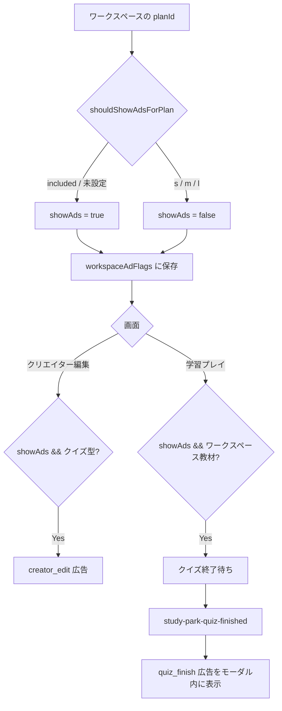

# 広告表示まとめ

Study Park の Google AdSense 広告について、**表示位置**と**表示条件**を整理したドキュメントです。

---

## 広告スロット一覧

| スロットキー | 画面 | 表示位置 |
|---|---|---|
| `creator_edit` | クリエイター：コンテンツ編集（`/creator/contents/edit`） | ページ見出し（「編集: …」）と「基本情報」セクションの間 |
| `quiz_finish` | 学習者：クイズプレイ（`/play?ws=...&slug=...`） | 全問終了時のお祝いモーダル内（メッセージ／画像と「もういちど」ボタンの間） |

レッスン教材（`type !== "quiz"`）や、ワークスペース以外の公開コンテンツには広告は表示されません。

---

## 表示条件

### 1. 課金プラン（無料枠のみ）

`lib/ads/visibility.ts` の `shouldShowAdsForPlan` で判定します。

| プラン（`planId`） | 広告 |
|---|---|
| `included`（無料枠） | 表示する |
| 未設定・`null` | 表示する（無料枠扱い） |
| `s` / `m` / `l`（有料プラン） | **表示しない** |

### 2. ワークスペース広告フラグ（Firestore）

コレクション `workspaceAdFlags/{workspaceId}` の `showAds` フィールドで制御します。

- `showAds === true` → 広告を表示
- ドキュメントが存在しない、または読み取り失敗時 → **デフォルトで表示**（`true`）

フラグはプランに応じて自動同期されます（`syncWorkspaceAdFlag`）。

- ワークスペース作成時
- プラン変更時（`applyBillingTierToWorkspace`）
- クリエイター編集画面の読み込み時

学習画面は未ログインでも読めるよう、このフラグだけを別コレクションに分離しています。

### 3. 画面ごとの最終判定

#### クリエイター編集画面

```
表示 = getWorkspaceShowAds(workspaceId) && shouldShowAdsForPlan(planId)
```

両方が `true` のときのみ `creator_edit` スロットを表示します。  
クイズ・レッスンいずれのコンテンツ編集画面でも、見出し直下の共通位置に配置されます。

#### 学習者プレイ画面（クイズ）

```
表示 = getWorkspaceShowAds(workspaceId)
```

- ワークスペース教材（`?ws=` または `?wid=` 付き）のみフラグを参照
- ワークスペース以外の公開コンテンツ（`slug` のみ）→ **常に非表示**

#### クイズ終了モーダル内のタイミング

`quiz_finish` スロットは、上記 `showAds` が `true` であることに加え、次のイベントで制御されます。

| イベント | 動作 |
|---|---|
| `study-park-quiz-finished`（全問終了・モーダル表示時） | 広告を表示 |
| `study-park-quiz-modal-closed`（モーダルを閉じた時） | 広告を非表示 |

クイズ進行中は広告は出ず、**セッション完了後のお祝いモーダル表示中のみ**出ます。

---

## AdSense 設定

環境変数（`.env.local`）でクライアント ID とスロット ID を指定します。

| 環境変数 | 用途 |
|---|---|
| `NEXT_PUBLIC_ADSENSE_CLIENT_ID` | AdSense パブリッシャー ID（例: `ca-pub-...`） |
| `NEXT_PUBLIC_ADSENSE_SLOT_CREATOR_EDIT` | クリエイター編集画面用スロット |
| `NEXT_PUBLIC_ADSENSE_SLOT_QUIZ_FINISH` | クイズ終了モーダル用スロット |

- クライアント ID とスロット ID の両方が揃っている場合のみ本番広告を読み込み
- 未設定時はプレースホルダー（「広告枠（AdSense のクライアント ID / スロット ID が未設定です）」）を表示
- スロット ID にはコード内のデフォルト値もフォールバックとして用意

広告フォーマット: `data-ad-format="auto"`、`data-full-width-responsive="true"`（レスポンシブ自動サイズ）

---

## 関連ファイル

| ファイル | 役割 |
|---|---|
| `lib/ads/config.ts` | クライアント ID・スロット ID の取得 |
| `lib/ads/visibility.ts` | プランに基づく表示判定 |
| `lib/workspaces/ad-flags.ts` | Firestore 広告フラグの読み書き |
| `components/ads/AdSenseUnit.tsx` | 広告ユニットコンポーネント |
| `app/creator/contents/edit/page.tsx` | クリエイター編集画面への配置 |
| `components/content/QuizShell.tsx` | クイズ終了モーダルへの配置 |
| `app/play/page.tsx` | 学習画面での `showAds` 判定 |
| `public/shared/quiz-blank-app.js` | 終了・モーダル閉じイベントの発火 |
| `public/ads.txt` | AdSense 用 ads.txt |

---

## フロー図（概要）


